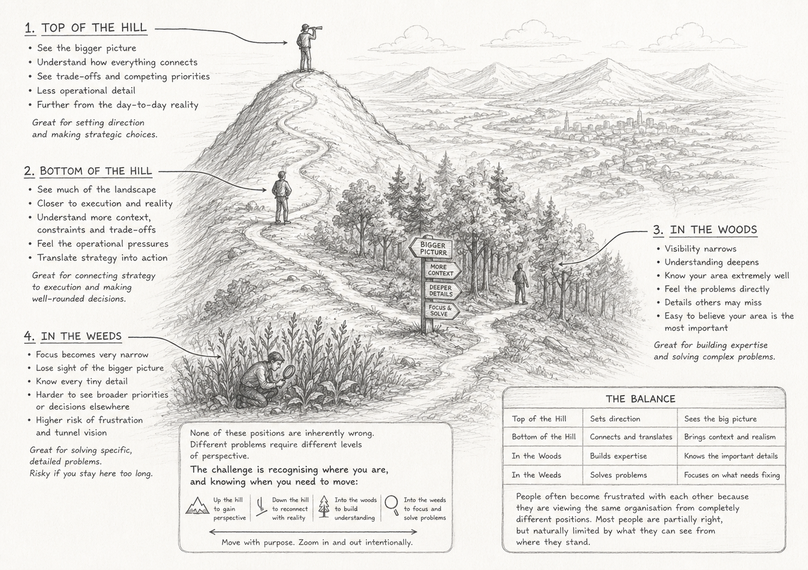

One idea I’ve had at work is how your perspective changes depending on how close you are to a project, product, or problem.

I think of it like a hill, with woods and weeds around it.

At the top of the hill, you can see the bigger picture. You understand how different parts connect, where the organisation is trying to go, and the trade-offs between competing priorities. But because you are further away, some of the operational detail becomes less visible.

At the bottom of the hill, you still have visibility of the wider landscape, but you are closer to execution. You begin to feel the realities, constraints, and operational pressures more directly.

In the woods, your visibility narrows, but your understanding deepens. You know your area extremely well because you live in it every day. You feel the problems directly and understand details others may completely miss. The closer you are to the work, the easier it becomes to believe your area is the most important, because you experience the consequences firsthand.

Then there are the weeds.

Being in the weeds is when your focus becomes so narrow that everything outside the immediate issue starts to disappear. You know every tiny detail of the problem in front of you, but it becomes harder to see broader business priorities, competing pressures, or why certain decisions are being made elsewhere.

The interesting thing is that none of these positions are inherently wrong. Different problems require different levels of perspective.

The challenge is recognising where you are, and knowing when you need to move:

- up the hill to regain perspective,
- down the hill to reconnect with reality,
- into the woods to build understanding,
- or into the weeds to solve difficult problems.

People often become frustrated with each other because they are viewing the same organisation from completely different positions. Most people are partially right, but naturally limited by what they can see from where they stand.

